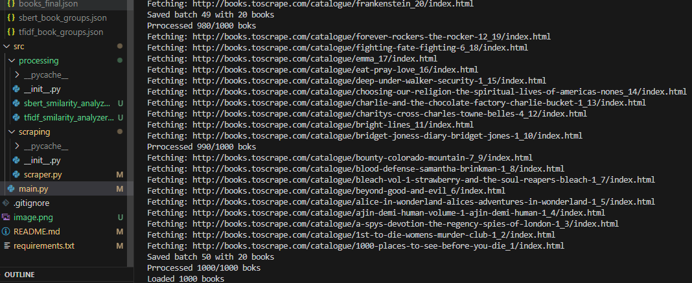
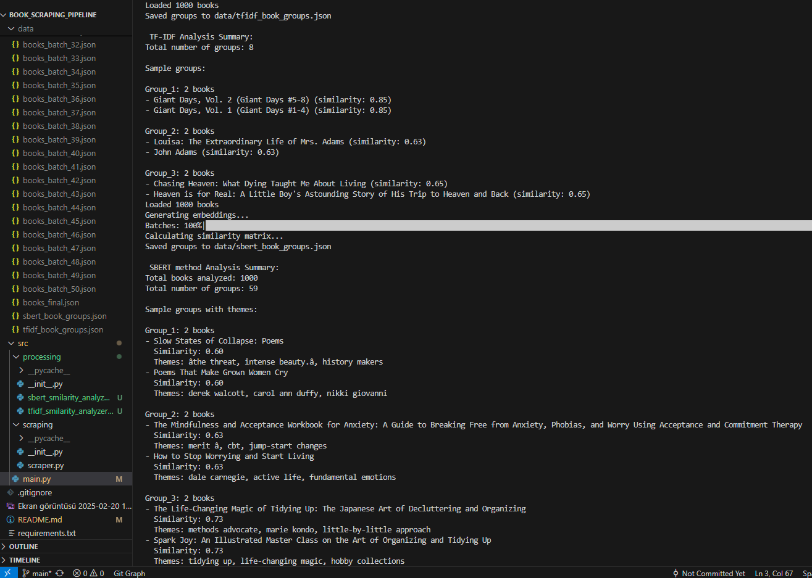

# Book Scraping and Analysis System

A web scraping solution for books.toscrape.com with advanced NLP-based analysis to group similar books based on their descriptions using TF-IDF and SBERT embeddings.

## Features
- 📚 Scrapes book metadata (title, rating, price, stock, description)
- 💾 Saves data in JSON format with batch processing
- 🧮 Displays total book count
- ⚡ Multi-threaded scraping with retry mechanism
- 🤖 Groups books by description similarity using TF-IDF, SBERT embeddings and cosine similarity

## Technologies Used
- **Python 3.10+**
- Web Scraping: `requests`, `BeautifulSoup4`
- Data Handling: `dataclasses`, `json`
- For parallel processing : `concurrent.futures`
- NLP Processing: `scikit-learn`
- Sentence Embedding: `sentence-transformers`

## Requirements
See `requirements.txt` for a complete list of dependencies:
```
beautifulsoup4==4.13.3
requests==2.31.0
scikit-learn==1.6.1
sentence-transformers==3.4.1
threadpoolctl==3.5.0
numpy==2.2.3
```

## Installation
1. Clone repository:
   ```bash
   git clone https://github.com/seHuzeyfe/book-scraping-pipeline.git
   cd book-scraping-pipeline
   ```

2. Create virtual environment:
   ```bash
   python -m venv book_scraping_pipeline_venv
   source book_scraping_pipeline_venv/bin/activate  # Linux/Mac
   book_scraping_pipeline_venv\Scripts\activate  # Windows
   ```

3. Install dependencies:
   ```bash
   pip install -r requirements.txt
   ```
4. Download the necessary Data for TextBlob
   ```bash
   python -m textblob.download_corpora
   ```

## Usage
Run the complete pipeline:
```bash
python main.py
```

### Process Flow:
#### Scraping Phase:
- Multi-threaded scraping of book data
- Automatic pagination handling
- Saves batches to `data/books_batch_*.json`
- Final output: `data/books_final.json`

#### Analysis Phase:
- Both method Loads scraped data from `data/books_final.json`

- Calculates TF-IDF vectors
- Groups books by cosine similarity (default: 0.6)
- Saves groups to `tfidf_book_groups.json`
- Prints summary to console

- Generates SBERT embeddings for book descriptions using the all-MiniLM-L6-v2 model
- Calculates a cosine similarity matrix between book embeddings
- Groups similar books based on a similarity threshold (default: 0.6)
- Extracts key themes from descriptions using TextBlob
- Saves similarity groups to `sbert_book_groups.json`
- Prints an analysis summary to the console

## Sample Outputs
### Book Data (`books_final.json`)
```json
[
  {
    "title": "A Light in the Attic",
    "rating": "3",
    "description": "It's hard to imagine a world without A Light in the Attic. This now-classic collection of poetry and drawings from Shel Silverstein celebrates its 20th anniversary with this special edition. Silverstein's humorous and creative verse can amuse the dowdiest of readers. Lemon-faced adults and fidgety kids sit still and read these rhythmic words and laugh and smile and love th It's hard to imagine a world without A Light in the Attic. This now-classic collection of poetry and drawings from Shel Silverstein celebrates its 20th anniversary with this special edition. Silverstein's humorous and creative verse can amuse the dowdiest of readers. Lemon-faced adults and fidgety kids sit still and read these rhythmic words and laugh and smile and love that Silverstein. Need proof of his genius? RockabyeRockabye baby, in the treetopDon't you know a treetopIs no safe place to rock?And who put you up there,And your cradle, too?Baby, I think someone down here'sGot it in for you. Shel, you never sounded so good. ...more",
    "price": 51.77,
    "in_stock": true,
    "quantity": 22
  },
  {
    "title": "Tipping the Velvet",
    "rating": "1",
    "description": "\"Erotic and absorbing...Written with starling power.\"--\"The New York Times Book Review \" Nan King, an oyster girl, is captivated by the music hall phenomenon Kitty Butler, a male impersonator extraordinaire treading the boards in Canterbury. Through a friend at the box office, Nan manages to visit all her shows and finally meet her heroine. Soon after, she becomes Kitty's \"Erotic and absorbing...Written with starling power.\"--\"The New York Times Book Review \" Nan King, an oyster girl, is captivated by the music hall phenomenon Kitty Butler, a male impersonator extraordinaire treading the boards in Canterbury. Through a friend at the box office, Nan manages to visit all her shows and finally meet her heroine. Soon after, she becomes Kitty's dresser and the two head for the bright lights of Leicester Square where they begin a glittering career as music-hall stars in an all-singing and dancing double act. At the same time, behind closed doors, they admit their attraction to each other and their affair begins. ...more",
    "price": 53.74,
    "in_stock": true,
    "quantity": 20
  },
]
```

### Similarity Groups

- (`tfidf_book_groups.json`)
```json
{
  "Group_1": [
    {
      "title": "Giant Days, Vol. 2 (Giant Days #5-8)",
      "description": "Susan, Esther, and Daisy started at university three weeks ago and became fast friends. Now, away from home for the first time, all three want to reinvent themselves. But in the face of hand-wringing ...",
      "similarity_score": 0.8470577311840505
    },
    {
      "title": "Giant Days, Vol. 1 (Giant Days #1-4)",
      "description": "Susan, Esther, and Daisy started at university three weeks ago and became fast friends. Now, away from home for the first time, all three want to reinvent themselves. But in the face of handwringing b...",
      "similarity_score": 0.8470577311840505
    }
  ],
}
```

- (`sbert_book_groups.json`)
```json
{
  "Group_1": [
    {
      "title": "Slow States of Collapse: Poems",
      "description": "The eagerly anticipated debut from one of Canada’s most exciting new poets In her debut collection, Ashley-Elizabeth Best explores the cultivation of resilience during uncertain and often trying tim...",
      "similarity_score": 0.6048353910446167,
      "themes": [
        "“the threat",
        "intense beauty.”",
        "history makers"
      ]
    },
    {
      "title": "Poems That Make Grown Women Cry",
      "description": "Following the success of their anthology Poems That Make Grown Men Cry, father-and-son team Anthony and Ben Holden, working with Amnesty International, have asked the same revealing question of 100 re...",
      "similarity_score": 0.6048353910446167,
      "themes": [
        "derek walcott",
        "carol ann duffy",
        "nikki giovanni"
      ]
    }
  ],
}
```

### Console Outputs
```
Loaded 1000 books
Saved groups to data/tfidf_book_groups.json

 TF-IDF Analysis Summary:
Total number of groups: 8

Sample groups:

Group_1: 2 books
- Giant Days, Vol. 2 (Giant Days #5-8) (similarity: 0.85)
- Giant Days, Vol. 1 (Giant Days #1-4) (similarity: 0.85)

Group_2: 2 books
- Louisa: The Extraordinary Life of Mrs. Adams (similarity: 0.63)
- John Adams (similarity: 0.63)

Group_3: 2 books
- Chasing Heaven: What Dying Taught Me About Living (similarity: 0.65)
- Heaven is for Real: A Little Boy's Astounding Story of His Trip to Heaven and Back (similarity: 0.65)

```

```
 SBERT method Analysis Summary:
Total books analyzed: 1000
Total number of groups: 59

Sample groups with themes:

Group_1: 2 books
- Slow States of Collapse: Poems
  Similarity: 0.60
  Themes: âthe threat, intense beauty.â, history makers
- Poems That Make Grown Women Cry
  Similarity: 0.60
  Themes: derek walcott, carol ann duffy, nikki giovanni

Group_2: 2 books
- The Mindfulness and Acceptance Workbook for Anxiety: A Guide to Breaking Free from Anxiety, Phobias, and Worry Using Acceptance and Commitment Therapy
  Similarity: 0.63
  Themes: merit â, cbt, jump-start changes
- How to Stop Worrying and Start Living
  Similarity: 0.63
  Themes: dale carnegie, active life, fundamental emotions

Group_3: 2 books
- The Life-Changing Magic of Tidying Up: The Japanese Art of Decluttering and Organizing
  Similarity: 0.73
  Themes: methods advocate, marie kondo, little-by-little approach
- Spark Joy: An Illustrated Master Class on the Art of Organizing and Tidying Up
  Similarity: 0.73
  Themes: tidying up, life-changing magic, hobby collections
```





## Comparison of TF-IDF and SBERT Methods

Both models group books based on description similarity but behave differently:

### **TF-IDF**
- Forms fewer groups (8 total), indicating broader categorization based on word overlap.  
- Higher similarity scores (e.g., 0.85) suggest strong lexical matches.  
- Captures surface-level similarities but may miss deeper semantic connections.  

### **SBERT**
- Produces more groups (59 total), detecting finer semantic differences.  
- Lower similarity scores (e.g., 0.60–0.73) but better at understanding meaning beyond exact words.  
- Extracts themes from descriptions, offering richer insights.  

### **Summary**
TF-IDF is simpler and groups books broadly, while SBERT provides more detailed, context-aware clustering.  


## Project Structure
```
.
├── data/                # Output JSON files
├── scraping/
│   ├── scraper.py       # Main scraping logic
├── processing/          # Analysis
│   ├── sbert_smilarity_analyzer2.py  # Tf-IDF NLP Method
│   ├── tfidf_smilarity_analyzer.py   # Sentence-BERT,Sentence Embeddings Method
├── main.py              # Entry point
├── README.md
└── requirements.txt
```

## Design Notes
### SOLID Principles:
- **Single Responsibility** (separate scraper/analyzer)
- **Open/Closed** (extendable scraping logic)
- **Dependency Inversion** (abstracted HTTP client)

### Patterns:
- **Factory Method** (Book dataclass)
- **Strategy** (similarity calculation using TF-IDF and SBERT embeddings)
- **Observer** (progress tracking)
